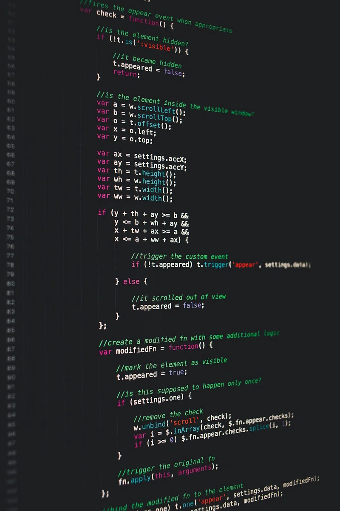

## Design Systems Overview
{#cover}

<Cover src="pictures/cover.jpg" alt=""/>

<div className="gap"></div>

[Varya Stepanova](https://varya.me) @ Aalto University, 2024

<style>{`
  #cover {
    padding-left: 60px;
    background-color: black;
    color: white;
  }
  #cover::after {
    display: none;
  } 
  #cover h2 {
    color: white;
    margin: 60px 0 30px;
    font-size: 50px;
    font-family: FF Meta Serif, sans-serif;
    line-height: 1.25em;
    margin-top: 275px;
    margin-bottom: 0;
    background-color: black;
    padding: 10px;
  }

  #cover h3 {
    width: 50%;
  }

  #cover p {
    margin: 10px 0 0;
    font-style: italic;
    font-size: 20px;
    width: 50%;
    line-height: 1.5em;
    background-color: black;
    padding: 10px;
  }
  #cover .gap {
    height: 10px;
  }
`}</style>


## Me
{ .no-title .about-me }


### Varya Stepanova
<b>Design Systems Architect</b><br/>
<small>engineering manager, frontend architect, independent consultant</small>

#### Contacts
<div className="contacts">
  <span className="linkedin"></span><a href="https://www.linkedin.com/in/varyastepanova/">linkedin.com/in/varyastepanova</a>
  <br/>
  <span className="globe"></span><a href="http://varya.me">varya.me</a>
  <br/>
  <span className="twitter"></span><a href="https://twitter.com/varya_en">@varya_en</a>
</div>


<style>{`
.about-me p {
  font-size: 80%;
}
.about-me .photo {
  float: left;
  width: 300px;
  margin-top: 1em;
  margin-bottom: 6em;
  margin-right: 1em;
  border-radius: 50%;
}

.about-me h4 {
  color: #ca4e1f;
  font: 1em/1 'FF Meta Serif',sans-serif;
  margin-bottom: .5em;
}
.about-me b {
  font-size: 1.25em;
}

.about-me .contacts {
  line-height: 1.5em;
  font-size: 0.8em;
}

.about-me .twitter
{
  content: "";
  display: inline-block;
  width: 1.5em;
  height: 1.5em;
  background-image:url(pictures/twitter-logo.png);
  background-size: cover;
  margin-right: 0.5em;
  margin-bottom: -0.25em;
}
.about-me .linkedin
{
  content: "";
  display: inline-block;
  width: 1.5em;
  height: 1.5em;
  background-image:url(pictures/linkedin-logo.png);
  background-size: cover;
  margin-right: 0.5em;
  margin-bottom: -0.25em;
}
.about-me .globe
{
  content: "";
  display: inline-block;
  width: 1.5em;
  height: 1.5em;
  background-image:url(pictures/globe.png);
  background-size: 1.15em;
  background-repeat: no-repeat;
  background-position: center;
  margin-right: 0.5em;
  margin-bottom: -0.5em;
}
`}</style>

<!--

My name is Varya. I work as an independent consultant, and design systems are my
major focus. I started with libraries of components about 10 years ago,
before the term "design systems" even emerged.

By that time, my own understanding and the community's was more technical.
We were paying a lot of attention to how to code the components,
how to document them.

Slightly by today, I changed my focus to more process and people oriented.
I realised that the biggest obstacle on the way is the gap between specialists:
designers and developers, product people and business people. In the meanwhile
I got a design education that helped me to see the picture at scale.

Nowadays, even though I am still doing a lot of hands-on and architectural frontend
work related to the design systems, I shift to engineering&project management, educating,
and enganging people.

-->

## Lecture Content

1. Large-scale project challenges
1. Web: CSS and JavaScript
1. Component-driven development
1. Design Systems

## Large-Scale Project Challenges
{ .block-list .title-08 }

- ### Complex Codebases<br/>
  Navigating intricate structures and dependencies in extensive projects.
- ### Large dynamic teams<br/>
  Coordinating work and maintaining consistency across diverse coding styles.
- ### Evolving Requirements<br/>
  Adapting to changing project needs while preserving code integrity.
- ### Maintenance Difficulties<br/>
  Keeping large codebases organized, efficient, and bug-free over time.

<!--
TODO: text
What is the focus of this lecture and how it is related to me as a professional.

v2, s3:
CSS and JavaScript Challenges in Large- Scale Projects
Large-scale web projects present unique challenges that can overwhelm even experienced developers. These projects often involve complex codebases, multiple developers working simultaneously, and constantly evolving requirements. As the project grows, maintaining consistency and managing updates becomes increasingly difficult, leading to a host of CSS and JavaScript-related issues.
Complex Codebases
Navigating and understanding extensive code structures becomes challenging as projects scale.
Multiple Developers
Coordinating efforts and maintaining consistency across a team of developers can lead to conflicts and inconsistencies.
Evolving Requirements
Adapting to changing project needs while maintaining code integrity becomes increasingly difficult over time.
Maintenance Difficulties
As projects grow, updating and maintaining code becomes more time-consuming and error-prone.
-->


## Where is CSS hard?
{ .slide--shout .slide--highlighted }

<!--
-->


## Building meme
{ .no-title .slide--full-image }


<!--
-->


## Is this good?

```css
H1 { color: blue }
P EM { font-weight: bold }
A:link IMG { border: 2px solid blue }
A:visited IMG { border: 2px solid red }
A:active IMG { border: 2px solid lime }
```

<!--
Now look at this code. Do you see something strange? Any guess?
Who would write their CSS like this?

The problem is that CSS was created to make text bold and links underlined. It ideally suited
solving these problems. In many websites developers still use CSS like.

Actually this code from [CSS level 1 specification](http://www.w3.org/TR/CSS1/). It is
very simple, was recommended in 1996. Time passed and we met new chalenges.
-->


## What makes CSS hard?

<ul>
  <li>Vertical centering</li>
  <li>Equal height columns</li>
  <li>Browser inconsistencies</li>
  <li className="next">Unobvious tricks</li>
</ul>

<!--
Before we decide what is wrong with that peice, let's guess what is hard in CSS.

When ppl are asked, the repson is usually
- vertical centing
- making columns of equial height
- browers render CSS differently, so it takes special knowledge and work to make the interface consistent
- many solutions are unobvious tricks which needed to be memorized

But this is not true, this is easy or at least clear how to manage. You can google for all this questions.
-->


## What <mark>really</mark> makes CSS hard?

* Scoping
* Specificity conflicts
* Non-deterministic matches
* Dependency management
* Removing unused code

<!--
The real hard problems of CSS are here:
- No scoping. Everything is CSS is global.
- Specificity conflicts. I'll explain in detal later.
- Non-deterministic matches which naturally result from declarativeness of CSS language
- Dependency management
- Removing unused code
-->


## CSS has no scoping

```css
a { /* Affects all the links */
  color: red;
}
ul li a { /* Affects all the links in lists */
  color: green;
}
```

<!--
This especially maters if you link third-party CSS.
A common problem for developing libraries or code which will be later delivered to another web site.
Everything in CSS is global, and writing good CSS is similar to writing a good program module if you only allowed to use
global variables.
This can be mixed with another CSS and applied to wrong nodes.
Writing good CSS means you has to predict the future.
-->


## Specificity

> Specificity is the means by which a browser decides which property values are the most relevant to an element and gets
> to be applied. Specificity is only based on the matching rules which are composed of selectors of different sorts.

<!--
Another problem is specificity.
Who remember what specificity is?
Ok, I will explain.
-->


## The most specific matters

```html
<div id="test">
  <span>Text</span>
</div>
```

```css
div#test span { color: green }
span { color: red }
div span { color: blue }
```

<!--
If a brower has 2, 3 or more rules which match the same DOM node, how it decides what are the properties to take into
work?
The order does not matter.
For every selector a browser calculates how important this set of rules is. The rule with the more specific selector
would be prioritized.
So, here we see...
-->


## How to overwrite?

```
<div class="sidebar">Left floated sidebar</div>
```

<div className="next">

```
.sidebar { /* Does it redefine `div.sidebar`?! */
  float: right;
}
```

</div>

<div className="next">

```
body .sidebar { /* Overwrites 'div.sidebar {}' */
  float: right;
}
```

</div>

<!--
When it comes to developments, specificity matters when redefining pre-given
components.

To redefine the left-floated sidebar, we would overwrite the rule.
-->


## Specificity hell
{: .no-title }

```css
.navbar-inverse .navbar-nav>li>a {
  color: #999;
}

#home-menu-container #home-menu li a {
  color: red;
}

body #home-menu ul li a {
  color: blue !important;
}
```
{: .code--size--m }

<!--
People ask on Stackoverflow how to overwrite Bootsrtap
These things can be in different files
-->


## Family guy meme
{ .no-title .slide--full-image }


## Non-deterministic matches

```css
#content div div {
  float: left;
}
```

<!-- This can be matched to anything -->
<!-- You cannot rely on the document structure, because it contantly changes while developing -->
<!-- в момент, когда ты пишешь, ты указываешь признаки нод, на которые сматчится правило, а не точный адрес. смотри:
можно писать адрес «Rettigweg 1, 13187 Berlin", а можно «около Wollankstrasse такая боковая улица с тремя домами, и
там есть такой желтый дом, и там на втором этаже ещё балконы металлические с узорами» -->

## Doctor meme
{ .no-title .slide--full-image }


<!--
-->


## Dependency management
{ .dependency-management }

### No dependencies, sorry

<div className="next">

<h3>But what about?</h3>

```
@import url('i-need-this.css');
```

</div>

### No, sorry again.
{ .next .sorry }

<style>{`
.dependency-management h3 {
  padding-top: 1em;
  margin-bottom: 0.5em;
}
.dependency-management .sorry
{
  color: green;
}
`}</style>

<!--
CSS was not developed as a programming language and now it still isn't. So, there is no way to declare that
one piece of CSS needs anotehr one.
OK, there is import. But this is not  aproduction solution. And assuming undeterministic matches we cannot rely on it.
-->


## Removing unused code

100 pages in projects

```css
.person div a {
  color: pink;
}
```

Can I remove it? Will it break something? Maybe it is for a third-party HTML code?

<!--
CSS is declarative, so you cannot say what are the nodes the rules will aply to.
If you have a lot of pages you cannot remove a piece of CSS and check visually if something is broken.
Even worse with  dynamic web sites.
-->


## Where CSS is hard?
{: .no-title .hard-css }

<table><thead>

<th markdown="1">

This is not hard in CSS

</th>

<th markdown="1">

This is!

</th>

</thead><tr>

<td className="left">

<Code>

#sidebar ul li a {
  <mark>color: red;</mark>
  <mark>display: block;</mark>
  <mark>padding: 1em;</mark>
}

</Code>

</td>

<td markdown="1">

```
<mark>#sidebar ul li a</mark> {
  color: red;
  display: block;
  padding: 1em;
}
```

</td>

</tr></table>

<!--
TODO: highlight lines
--->


## Where is JavaScript hard?
{ .slide--shout .slide--highlighted }

<!--
-->

## Old-School JavaScript Challenges
{ .numbered-list .title-08 }

- ### Direct DOM Manipulation
  Messy code with direct element selection and modification.
- ### Event Handling Complexity
  Difficult management of multiple event listeners and callbacks.
- ### State Management
  Lack of centralized state leading to inconsistent UI updates.
- ### Maintenance Problems
  Spaghetti code without clear structure, making updates risky.

<!--
-->

## Vanilla Js or Component Driven?
{ .no-title }


| Vanilla Js    | Component-Driven |
| -------- | ------- |
| Direct DOM manipulation, global functions, and scattered state management.  | Encapsulated logic, isolated state, and reusable UI building blocks.    |

### Structured components lead to cleaner, more maintainable code

<!--
TODO: Move or remove this slide
-->

## Maintenance Mayhem
{ .block-list }

- ### Code Comprehension
  Difficulty understanding complex, intertwined code over time.
- ### Risky Updates
  Fear of breaking unknown dependenciesч when making changes.
- ### Inconsistent Components
  Similar components diverge, leading to maintenance nightmares.
- ### Scalability Issues
  Growing projects become increasingly difficult to manage and expand.

## Component-Driven Development
{ .slide--shout .slide--primary }

<!--
-->


## Component-Driven Development
{ .numbered-list .title-08 }

- ### UI Breakdown
  Dividing interfaces into reusable, independent components.
- ### Encapsulation
  Bundling functionality and styling within self- contained units.
- ### Consistency
  Promoting uniform design and behavior across the application.
- ### Maintainability
  Easier updates and bug fixes with isolated component logic

<!--
Slides: v1 #12
-->

## Benefits of Component-Driven Development
{ .title-06 .cover--top .table--naked .text-08 }

<Cover src="pictures/v1-13.jpg" alt=""/>

| Reusability | Easier Testing | Improved Collaboration | Faster Development |
|----------|----------|----------|----------|
| Components can be easily reused across different parts of the application. | Isolated components allow for more straightforward and thorough testing. | Designers and developers can work more efficiently on specific components. | Reusable components speed up the development and iteration process. |


<!--
--->

## Component-Driven Development in JavaScript Frameworks
{ .no-title }

{: .cover--right .cover }

### React
Virtual DOM, JSX syntax

### Angular
Directives, two-way data binding

### Vue
Reactivity system, template-based components

### Web Components (Lit, Stencil)
Framework-agnostic

<!--
-->


## CSS Modules
{ .block-list .text-08 }

- **Scoped Styles by Default**: CSS Modules provide scoped styles by default, preventing global conflicts.
- **Automatic Unique Class Names**: Class names are automatically transformed into unique identifiers, ensuring local scope.
- **Easy Style Composition**: Allows for composition of styles across multiple CSS Modules, enabling reusable and modular design.
- **CSS Isolation**: Avoids styling collisions by scoping styles to individual components, promoting maintainable and scalable code.

<!--
-->

## CSS-in-JS: Dynamic Styling
{ .numbered-list .title-08 }

- ### Styled-components
  Allows you to write CSS directly within JavaScript.
- ### Emotion
  Supports for both string and object styles.
- ### JSS
  CSS as JavaScript objects, commonly used with React.
- ### Stitches
  Near-zero runtime, lightweight, focus on architecture.


<!--
-->

## Best Practices for Modular Design
{ .title-08 }

- **Single Responsibility Principle**: Each component should have one clear purpose or functionality.
- **Composability**: Design components that can be easily combined to create complex UIs.
- **Naming Conventions**: Maintain consistent and descriptive naming for components and props.

<!--
-->


## From technology to a system
{ .slide--shout }

<!--
-->


## Design and UI require a systematic approach​
{ .systematic-approach }

<Cover src="pictures/car-parts.jpg" alt=""/>

<style>{`
  .systematic-approach h2 {
    bottom: 25px;
    position: absolute;
    background-color: #b7c9e2;
    margin-right: 100px;
    padding: 10px;
  }
`}</style>

<!--
-->


## Introduction to Design Systems
{ .slide--shout .slide--primary }

<!--
-->

## Diagram 1
{ .no-title .vocabulary-diagram }

{: .cover }

"Design Systems Vocabulary — A Review of Key Terms and Concepts", https://varya.me/blog/design-systems-review/

<style>{`

.vocabulary-diagram .cover {
  width: auto;
  height: 80%;
  padding-bottom: 1.5em;
}

.vocabulary-diagram p {
  position: absolute;
  bottom: 1em;
  font-size: 0.6em;
}

`}</style>

## Diagram 2
{ .no-title .vocabulary-diagram }

<Cover src="pictures/diagram-2.png" alt=""/>

"Design Systems Vocabulary — A Review of Key Terms and Concepts", https://varya.me/blog/design-systems-review/

## Diagram 3
{ .no-title .vocabulary-diagram }

<Cover src="pictures/diagram-3.png" alt=""/>

"Design Systems Vocabulary — A Review of Key Terms and Concepts", https://varya.me/blog/design-systems-review/

## Diagram 4
{ .no-title .vocabulary-diagram }

<Cover src="pictures/diagram-4.png" alt=""/>

"Design Systems Vocabulary — A Review of Key Terms and Concepts", https://varya.me/blog/design-systems-review/

<!--
-->


## Definition
{ .no-title .slide--shout .definition }

Design systems are the foundation of consistent user interfaces. They provide reusable components, patterns, and guidelines for creating cohesive products across platforms.

<div class="arrow-down"></div>

<Blockquote>
"Design systems" is a systematic approach for creating, implementing, and maintaining user interfaces.
</Blockquote>

<style>{`

.definition .arrow-down {
  width: 0;
  height: 0;
  border-left: 30px solid transparent;
  border-right: 30px solid transparent;
  border-top: 60px solid #ca4e1f; /* Arrow triangle color */
  position: relative;
  margin: 50px auto;
}

.definition .arrow-down::before {
  content: '';
  position: absolute;
  top: -60px;
  left: -5px;
  width: 10px;
  height: 60px;
  background-color: #75d3d1; /* Tail color */
  z-index: -1;
}

.definition .arrow-down::after {
  content: '';
  position: absolute;
  top: -5px;
  left: -35px;
  width: 70px;
  height: 70px;
  background-color: rgba(0, 0, 0, 0.2); /* Black shadow */
  border-radius: 50%;
  z-index: -2;
}

`}</style>

<!--
-->


## Key Components of a Design System
{ .key-components .title-08 }

- ### Design Tokens
  Fundamental design elements like colors, typography, and spacing.
- ### UI Components
  Reusable interface elements such as buttons, forms, and cards.
- ### Patterns
  Recurring solutions for layout structures and interaction patterns.
- ### Guidelines
  Usage rules, accessibility standards, and best practices.

<style>{`

.slide.key-components ul {
    list-style-type: none;
    padding: 0;
    font-size: 0.8em;
}

.slide.slide.key-components ul li {
    padding-left: 2.25em;
}

.slide.slide.key-components ul > li:before {
  content: '';
  display: inline-block;
  width: 24px;
  height: 24px;
  margin-right: 10px;
  background-size: contain;
  background-repeat: no-repeat;
  left: -1.25em;
}

.slide.key-components ul li:nth-child(1)::before {
  background-image: url(icons/design-tokens-icon.svg);
  color: transparent;
}
.slide.key-components ul li:nth-child(2)::before {
  background-image: url(icons/ui-components-icon.svg);
  color: transparent;
}
.slide.key-components ul li:nth-child(3)::before {
  background-image: url(icons/patterns-icon.svg);
  color: transparent;
}
.slide.key-components ul li:nth-child(4)::before {
  background-image: url(icons/guidelines-icon.svg);
  color: transparent;
}
`}</style>

<!--

v8 s2:
"What is a Design System?
Reusable Components
A collection of UI elements like buttons, forms, and cards that can be used across multiple projects and platforms.
Design Patterns
Standardized solutions to common design problems, ensuring consistency in user interactions and layouts.
Guidelines
Clear instructions on how to use components and patterns, including best practices for accessibility and usability.
Single Source of Truth
A centralized resource that serves as the definitive reference for all design and development decisions within an organization."
-->


## Design Systems — Why?
{ .numbered-list .list-table .title-08 }


<table>
<tr>
<td>

- ### Consistency Across Products
  Design systems ensure a unified look and feel across all digital products, reinforcing brand identity and improving user recognition.
- ### Enhanced Collaboration
  A shared language and resource base foster better communication between designers, developers, and other stakeholders.

</td>

<td>

- ### Accelerated Development
  By providing pre-built components and clear guidelines, design systems significantly reduce development time and effort.
- ### Simplified Onboarding
  New team members can quickly understand and contribute to projects by referencing the comprehensive design system documentation.

</td>
</tr>
</table>

<style>{`

.slide.list-table ul {
  counter-reset: li 2;
}

`}</style>

<!--
-->

## Do those buttons function the same way?​
{ .no-title .button }

### Do those buttons function the same way?​
{ .next .question }

<Cover src="pictures/buttons.png" alt=""/>

##### Credits: Andrey Okonetchnikov, https://www.youtube.com/watch?v=sV4chQq-H7o 
{ .credits }

<style>{`
.button .cover {
  margin-top: -50px;
}
.button .question {
  background-color: white;
  font-size: 60px;
  padding: 10px;
  margin-top: 60px;
}
.button .credits {
  font-size: 60%;
  position: absolute;
  bottom: 25px;
}
`}</style>

<!--
TODO: Explain why consitency is important
-->


## Design Tokens: The Building Blocks
{ .slide--3-columns .title-08 .text-08 }

### Colors

A color palette that includes primary, secondary, and accent colors, along with their various shades and tints. These colors are used consistently across all UI elements to maintain visual harmony.

### Typography

A set of font families, sizes, weights, and line heights that define the textual hierarchy and readability of the interface. This includes headings, body text, captions, and other typographic elements.

### Spacing 

Standardized units of measurement for margins, padding, and layout grids. Consistent spacing ensures proper alignment and visual rhythm throughout the interface.

<!--
<Cover src="slides/v8-4.png" alt=""/>

-->


## UI Components: The Building Blocks of UI
{ .ui-components .title-06 }

- ### Buttons
  Interactive elements that trigger actions or navigate users to different parts of the application.
- ### Forms
  Input fields, checkboxes, and other elements that allow users to enter and submit data.
- ### Cards
  Containers for presenting related information in a compact and visually appealing format.
- ### Navigation
  Menus, breadcrumbs, and other elements that help users move through the application.

<style>{`
.slide.ui-components ul {
    list-style-type: none;
    padding: 0;
    font-size: 0.8em;
}

.slide.ui-components ul li {
    padding-left: 2.25em;
    margin-bottom: 0.5em;
}

.slide.ui-components p {
  margin-bottom: 0;
}

.slide.slide.ui-components ul li:before {
  content: '';
  display: inline-block;
  width: 24px;
  height: 24px;
  margin-right: 10px;
  background-size: contain;
  background-repeat: no-repeat;
  position: absolute;
  left: 0;
  top: 0.25em;
}

.slide.ui-components ul li:nth-child(1)::before {
  color: transparent;
  background-image: url(icons/buttons-icon.svg);
}
.slide.ui-components ul li:nth-child(2)::before {
  color: transparent;
  background-image: url(icons/forms-icon.svg);
}
.slide.ui-components ul li:nth-child(3)::before {
  color: transparent;
  background-image: url(icons/cards-icon.svg);
}
.slide.ui-components ul li:nth-child(4)::before {
  color: transparent;
  background-image: url(icons/navigation-icon.svg);
}

.slide.ui-components h3 {
  margin-bottom: 0.25em;
}

.slide.ui-components p {
  margin-top: 0;
}
`}</style>


<!--
<Cover src="slides/v8-5.png" alt=""/>
-->

## Patterns: Solving Common UI Challenges
{ .numbered-list .title-06 .text-06 .patterns }

{: .cover--right .cover }

- ### Layout Structures
   Standardized arrangements of UI elements, such as grid systems and responsive layouts, that ensure consistency across different screen sizes and devices.

- ### Interaction Patterns
   Common user behaviors and expectations, like hover effects, drag-and-drop functionality, and scrolling behaviors, that are implemented consistently throughout the interface.

- ### Data Visualization
   Guidelines for presenting complex information in easily digestible formats, including charts, graphs, and infographics.

- ### Error Handling
   Consistent approaches to displaying and resolving errors, including form validation, error messages, and recovery options.

<style>{`

.patterns {
padding-right: 20em;
}

`}</style>


<!--

<Cover src="slides/v8-6.png" alt=""/>


v8, s6:
"Layout Structures
Standardized arrangements of UI elements, such as grid systems and responsive layouts, that ensure consistency across different screen sizes and devices.
Interaction Patterns
Common user behaviors and expectations, like hover effects, drag-and-drop functionality, and scrolling behaviors, that are implemented consistently throughout the interface.
Data Visualization
Guidelines for presenting complex information in easily digestible formats, including charts, graphs, and infographics.
Error Handling
Consistent approaches to displaying and resolving errors, including form validation, error messages, and recovery options."
-->

## Guidelines: Ensuring Proper Implementation
{ .numbered-list .title-06 .text-06 .guidelines }

{: .cover--right .cover }

- ### Usage Rules
   Clear instructions on when and how to use specific components and patterns, including do's and don'ts to maintain consistency and effectiveness.

- ### Accessibility Standards
   Detailed requirements for ensuring that all UI elements are accessible to users with disabilities, including color contrast ratios, keyboard navigation, and screen reader compatibility.

- ### Responsive Design Guidelines
   Principles for adapting layouts and components to different screen sizes and devices, ensuring a consistent experience across platforms.

- ### Brand Voice and Tone
   Guidelines for maintaining a consistent brand personality in all textual elements, including microcopy, headings, and error messages.

<style>{`

.guidelines {
padding-right: 20em;
}

`}</style>


<!--

<Cover src="slides/v8-7.png" alt=""/>

v8, s7:
"Usage Rules
Clear instructions on when and how to use specific components and patterns, including do's and don'ts to maintain consistency and effectiveness.
Accessibility Standards
Detailed requirements for ensuring that all UI elements are accessible to users with disabilities, including color contrast ratios, keyboard navigation, and screen reader compatibility.
Responsive Design Guidelines
Principles for adapting layouts and components to different screen sizes and devices, ensuring a consistent experience across platforms.
Brand Voice and Tone
Guidelines for maintaining a consistent brand personality in all textual elements, including microcopy, headings, and error messages."
-->

## Examples
{ .slide__examples }

- Fluent (by Microsoft) https://www.microsoft.com/design/fluent​
- Atlassian Design System https://atlassian.design/ ​
- Carbon (by IBM) https://www.carbondesignsystem.com/ ​
- Airbus Design System https://maevahemon.fr/airbus.html ​
- Material UI by Google https://material.io/​
- Polaris (by Shopify) https://polaris.shopify.com/ ​
- US government Design System https://designsystem.digital.gov/ ​
- Audi Design System https://www.audi.com/ci/en/guides/user-interface/introduction.html​
- UK government Design System https://design-system.service.gov.uk/ 

<style>{`
  .slide__examples {
    font-size: 80%;
  }
`}</style>

<!--
<Cover src="slides/v1-20.png" alt=""/>
-->


## Design System Catalogs
{ .slide--3-columns .catalogs }

### [Design Systems Surf](https://designsystems.surf/)

### [Component Gallery](https://component.gallery/)

### ["Complete" Design System](https://miro.com/app/board/uXjVPXCoofw=/)

<style>{`

.catalogs.slide {

  padding-top: 9em;
}

.catalogs.slide a {
  text-decoration: none;
  background: none;
}

`}</style>

<!--

<Cover src="slides/v8-9.png" alt=""/>

v8, s9:
"Design Systems Surf
A curated collection of design systems from various companies and organizations. It provides a valuable resource for designers and developers looking to explore different approaches to design system creation and implementation.
Design Systems Surf
Component Gallery
An extensive library of UI components from various design systems. It allows users to compare how different design systems approach common UI elements, providing inspiration and insights for component design.
Component Gallery
Defining Components
A guide on how to effectively use design system catalogs when defining components for your own system. It provides strategies for analyzing existing solutions and adapting them to your specific needs.
Defining Components Guide"
-->

## Design Systems Advantages
{ .slide--shout .slide--highlighted }

<!--
-->


## Design-and-Development Disconnect

- Different tools and Workflows
- Mental Models
- Communication Challenges
- Unoptimal Organisation Structure

<!--

<Cover src="slides/v1-21.png" alt=""/>

v8, s11:
"Different Tools and Workflows
Designers often use tools like Sketch or Figma, while developers work in code editors, leading to potential discrepancies in how designs are interpreted and implemented.
Inconsistent Interpretations = Mental models
Without clear guidelines, developers may interpret design elements differently, resulting in variations from the original design intent.
Communication Challenges
Designers and developers may use different terminology or have different priorities, leading to misunderstandings and inefficiencies in the development process.
Time Lost in Back-and-Forth
Frequent clarifications and revisions due to misalignment can significantly slow down the development process and delay project timelines."
-->

## [Aligning UX designers and UI developers work with design systems](https://varya.me/design-systems/aligning-ux-designers-and-ui-developers/)
{ .slide--shout .thesis }

Master thesis in International Design Business Management (IDBM)<br/> by Varya Stepanova, Aalto University, 2021

<style>{`

.thesis.slide {
  padding-bottom: 2em;
}

.thesis.slide h2 {
  line-height: 1.25em;
}
.thesis.slide p {
  line-height: 1.25em;
}

.thesis.slide a {
  text-decoration: none;
  background: none;
}

`}</style>

<!--
-->

## What exactly changes?
{ .slide--shout }


## The old school way​
{ .cover-w-80 .black }

<Cover src="pictures/old-school.png" alt=""/>


## Dashed process​
{ .cover-w-80 .black }

<Cover src="pictures/dashed-process.png" alt=""/>


## Products are systems
{ .no-title .slide--shout }

<Blockquote caption="Anna Debenham​">
Products are systems rather than pages and as soon as we stop perceiving them as that, the better.
</Blockquote>


## UI composition
{ .cover-w-80 }

<Cover src="pictures/bem-blocks.png" alt=""/>


## Creating UI with a design system​
{ .cover-w-80 .black }

<Cover src="pictures/workflow-ds.png" alt=""/>

<!--
-->


## Tools for Design Systems
{ .numbered-list }

- ### Design and Handoff
- ### Documenting
- ### Tokens Streamline
- ### Development Playgrounds
- ### Testing

<!--
-->

## Tools examples
{ .no-title .numbered-list .text-08 }

- ### Design and Handoff
  Figma, Sketch, Zeplin
- ### Documenting
  Storybook, Zeroheight, Confluence, Notion
- ### Tokens Streamline
  Style Dictionary, Supernova
- ### Development Playgrounds
  Storybook, Bit.dev
- ### Testing
  Chromatic, Testplane, Jest

<!--
1. ### Design and Handoff
   - **Figma**: A cloud-based design tool for collaboration and handoff to developers.
   - **Sketch**: A vector design tool, especially popular for UI/UX design.
   - **Adobe XD**: A design and prototyping tool that integrates well with other Adobe products.
   - **Zeplin**: Helps bridge the gap between designers and developers by providing detailed design specs for handoff.

2. ### Documenting
   - **Storybook**: A tool for developing and documenting UI components in isolation.
   - **Zeroheight**: A design system documentation tool that integrates with Figma, Sketch, and Adobe XD.
   - **Confluence**: A documentation platform that can be used to create and organize design system guidelines.
   - **Notion**: A flexible tool for creating documentation, useful for both design systems and general team collaboration.

3. ### Tokens Streamline
   - **Style Dictionary**: A tool that helps maintain design tokens and transforms them into various formats for use in code.
   - **Supernova**: A platform that converts design tokens into code for various platforms.
   - **Specify**: A tool for synchronizing design tokens and assets between design and development.

4. ### Development Playgrounds
   - **CodeSandbox**: An online code editor that enables real-time development and sharing of UI components.
   - **StackBlitz**: A development environment for quickly building, testing, and sharing design system components in real-time.
   - **Storybook**: A widely-used tool for developing UI components in isolation and visualizing their different states.

5. ### Testing
   - **Jest**: A JavaScript testing framework that helps ensure design system components behave correctly.
   - **Cypress**: A testing tool for end-to-end testing that can be used to ensure consistent user interfaces.
   - **Chromatic**: A visual testing tool for Storybook that helps catch UI bugs by comparing component snapshots.
   - **Percy**: A visual testing tool that captures screenshots and compares them for visual regressions.

v8, s14:
"Collaborative Design
Figma allows multiple designers to work on the same file simultaneously, fostering real-time collaboration and faster iteration cycles. This feature is particularly useful for large teams working on complex design systems.
Component Libraries
Figma's robust component system enables the creation of reusable UI elements that can be easily updated across all instances. This ensures consistency throughout the design process and makes it easier to maintain large-scale design systems.
Developer Handoff
Figma provides developers with easy access to design specifications, including CSS properties, dimensions, and asset exports. This streamlines the handoff process and reduces the likelihood of misinterpretation during implementation."

v8, s15:
"Component Development
Storybook provides an isolated environment for developing and testing UI components, allowing developers to focus on one component at a time without the complexities of the full application.
3 Visual Testing
Storybook integrates with visual regression testing tools, allowing teams to catch unintended changes to component appearance automatically during the development process.
2 Interactive Documentation
With Storybook, teams can create living documentation that showcases components in various states and configurations, making it easier for both designers and developers to understand and use the design system.
4 Addon Ecosystem
A rich ecosystem of addons extends Storybook's functionality, offering features like accessibility testing, responsive design tools, and design token integration."
-->

## Business value of<br/>design system
{ .business-value }

{: .cover .cover--right }

- Product recognizability​
- Faster design and development​
- Fewer costs​
- "Time to market" decreased​
- Doing "real work"


<style>{`

.business-value.slide .cover {
  left: 60%;
}

`}</style>


## Getting mature
{ .getting-mature }

<div class="arrow">⬅</div>

{ .image }

<style>{`

.getting-mature .image {
  height: 400px;
}

.getting-mature .arrow {
  font-size: 200px;
  color: #fff;
  font-family: "ubuntu";
  text-transform: uppercase;
  font-weight: 700;
  font-family: "Josefin Sans", sans-serif;
  background: linear-gradient(to right, #38bcc2 10%, #ca4e1f 50%, #e69445 60%);
  background-size: auto auto;
  background-clip: border-box;
  background-size: 200% auto;
  color: #fff;
  background-clip: text;
  text-fill-color: transparent;
  -webkit-background-clip: text;
  -webkit-text-fill-color: transparent;
  animation: textclip 1.5s linear infinite;
  display: inline-block;
  position: absolute;
  top: 50px;
  right: 250px;

}
@keyframes textclip {
	to {
		background-position: 200% center;
	}
}

`}</style>


## Maturity
{ .no-title }

### The highest levels of maturity are achieved with design systems

The very fact of design systems emerging as a new approach and a set of artifacts that affect the process of development demonstrates the subject of Organizational Innovation and Deployment.

<!--
-->


## Design Systems Advanced Challenges
{ .slide--shout .slide--primary }

<!--
-->


## Advanced challenges
{ .block-list .advanced-challenges .title-08 }

{: .cover .cover--right }

- ### Maintaining and Scaling Design Systems
- ### API
- ### Balance between standartisation and customization
- ### Autiomations

<style>{`

.advanced-challenges.slide {
  padding-right: 18em;
}

`}</style>

<!--

Comment from Arnaud:
"In my experience, when you want to bridge the gap between design and engineering, the winning combo is to align the APIs and ensure that what designers have access to is also available in dev (and, of course, the other way around). 

The second topic is the balance between configuration and customization, the best way to illustrate that is this amazing article from Spotify engineering team: https://engineering.atspotify.com/2023/05/multiple-layers-of-abstraction-in-design-systems/"


v8, s27:
"Automated Testing
Implement comprehensive unit tests and visual regression tests to catch issues early and ensure consistent component behavior.
CI/CD for Design Tokens
Set up continuous integration and deployment pipelines to automatically update and distribute design tokens across all platforms.
Documentation Generation
Use tools that automatically generate and update documentation from code comments and component metadata.
Linting for Consistency
Implement linting tools to enforce coding standards and catch potential issues before they make it into production."
-->

## Future Trends in Design Systems
{ .slide--shout .slide--highlighted }

## Future Trends in Design Systems
{ .numbered-list }

- ### More automations
- ### Dynamic theming
- ### Smarter testing
- ### Easier adoption in products

<!--

1️⃣ More automation: I think we’ll see more routine tasks being handled by algorithms. Not necessarily AI, but tools and plugins that simplify the “monkey work.”

2️⃣ Dynamic theming: Themes adjusting based on user preferences or the environment. It won’t be for every product, but it’s definitely a trend to watch. This ties into computational design tokens and a more systematic approach overall.

3️⃣ Smarter testing: I’m hoping we get more advanced testing tools for both design and development — something like visual regression testing, but not as rigid, ensuring design and code stay in sync.

4️⃣ Easier design system adoption: Especially for engineers because what they do faces the users. I’d love to see tools that automatically spot areas where a custom-built component could be replaced with a design system one. 

<Cover src="slides/v1-29.png" alt=""/>

v8, s28:
"Automated Component Suggestions
AI algorithms could analyze design patterns and suggest appropriate components or layouts based on the context and user needs, speeding up the design process.
Design Pattern Recognition
Machine learning models could identify common design patterns across an organization's products, helping to standardize and optimize the design system.
Accessibility Improvements
AI-powered tools could automatically detect and suggest fixes for accessibility issues, ensuring compliance with WCAG guidelines and improving overall usability."
-->


## Thank you
{ .thanks }


#### [Slides: varya.me/design-systems-overview-2024/](https://varya.me/design-systems-overview-2024/)

#### by Varya Stepanova

<div className="contacts">
  <span className="linkedin"></span><a href="https://www.linkedin.com/in/varyastepanova/">linkedin.com/in/varyastepanova</a>
  <br/>
  <span className="globe"></span><a href="http://varya.me">varya.me</a>
  <br/>
  <span className="twitter"></span><a href="https://twitter.com/varya_en">@varya_en</a>
</div>


<style>{`

.thanks h3 {
  font-size: 28px;
  margin-bottom: 0.5em;
  margin-top: 1em;
  line-height: 1.25em;
  font-family: "Graphik Light";
}

.thanks .slides,
.thanks .slides a {
  color: #ca4e1f;
  font-family: "Graphik Light";
  text-transform: none;
}

.thanks .photo {
  float: left;
  width: 150px;
  margin-top: 1em;
  margin-bottom: 8em;
  margin-right: 1em;
  border-radius: 50%;
}

.thanks .contacts {
  line-height: 1.5em;
  font-size: 0.8em;
}
.thanks .contacts li:before {
  content: '';
}

.thanks .twitter
{
  content: "";
  display: inline-block;
  width: 1.5em;
  height: 1.5em;
  background-image:url(pictures/twitter-logo.png);
  background-size: cover;
  margin-right: 0.5em;
  margin-bottom: -0.5em;
}
.thanks .linkedin
{
  content: "";
  display: inline-block;
  width: 1.5em;
  height: 1.5em;
  background-image:url(pictures/linkedin-logo.png);
  background-size: cover;
  margin-right: 0.5em;
  margin-bottom: -0.25em;
}
.thanks .globe
{
  content: "";
  display: inline-block;
  width: 1.5em;
  height: 1.5em;
  background-image:url(pictures/globe.png);
  background-size: 1.15em;
  background-repeat: no-repeat;
  background-position: center;
  margin-right: 0.5em;
  margin-bottom: -0.5em;
}
`}
</style>